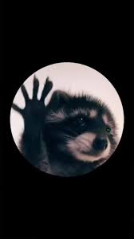

# О себе
- ФИО: Енот Педро 
- Фото:  

- Информация о себе:  
  1. Еноты очень любят свои хвосты, стараются их не мочить, постоянно вычесывают и ухаживают как за своими, так и за хвостами сородичей.
  2. Кожа на лапках очень нежная, бархатистая, на подушечках даже иногда возникают натоптыши.
  3. Енот способен издавать более 30 звуков, от угрожающего рыка, подобно собачьему, до нежной трели, схожей с пением птиц. Особенно «разговорчивы» детеныши енотов.
  4. Спасаясь от преследователей, енот часто притворяется мёртвым.

